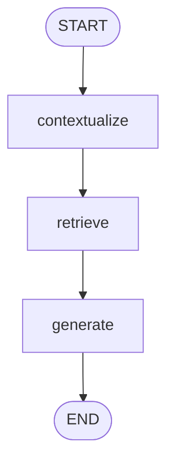

# Context-Aware RAG Chatbot

A FastAPI + LangGraph chatbot that retrieves from a Chroma vector store, keeps
multi-turn context with LangGraph memory, rewrites follow-up questions into
standalone queries, and streams answers to a simple web UI.

Links:

- Docker Hub image: `REPLACE_ME` (e.g. `docker pull <your-namespace>/context-chatbot:latest`)
- GitHub repo: `REPLACE_ME` (e.g. `https://github.com/<you>/context-chatbot`)
- Demo video: TODO

## Run with Docker

```bash
docker run --rm -p 8000:8000 -e GROQ_API_KEY=your_key_here REPLACE_ME/context-chatbot:latest
```

Then open http://localhost:8000.

Build and push it yourself:

```bash
docker build -t REPLACE_ME/context-chatbot:latest .
docker run --rm -p 8000:8000 -e GROQ_API_KEY=your_key_here REPLACE_ME/context-chatbot:latest
docker push REPLACE_ME/context-chatbot:latest
```

Or with Compose (reads `GROQ_API_KEY` from your shell or a local `.env`):

```bash
GROQ_API_KEY=your_key_here docker compose up --build
```

The image is multi-stage. It installs dependencies with `uv sync --frozen`, builds
the Chroma index and caches the embedding model at build time, then copies them into
a slim runtime image. Only `GROQ_API_KEY` is needed at run time, and no secrets are
baked into the image.

## Run locally

```bash
uv sync
uv run python -m app.ingest
GROQ_API_KEY=your_key_here uv run uvicorn app.main:app --reload
```

Notes:

- Run `app.ingest` once to build the index before starting the server. The app
  loads the prebuilt index and will not start without it.
- `app.ingest` reads the committed corpus in `docs/` and needs no network, so the
  index is reproducible.
- Chroma stores its index in a local sqlite database, which does not work on exFAT
  or network volumes. If the project lives on such a drive, point the index at an
  internal-disk path for local development (Docker is unaffected):

  ```bash
  export CHROMA_DIR=~/.cache/context-chatbot/chroma
  uv run python -m app.ingest
  GROQ_API_KEY=your_key_here uv run uvicorn app.main:app --reload
  ```

## Environment variables

The Groq key is read from the environment or a local `.env`. A missing key does not
crash startup; the error surfaces on the first chat request (an SSE `error` event in
the UI, or a 500 from `POST /chat`).

- `GROQ_API_KEY` (required) — Groq API key for chat completions
- `ANSWER_MODEL` (default `llama-3.3-70b-versatile`) — Groq model for answers
- `FAST_MODEL` (default `llama-3.1-8b-instant`) — Groq model for query rewriting
- `EMBEDDING_MODEL` (default `sentence-transformers/all-MiniLM-L6-v2`) — embedding model, used for both ingest and query
- `WIKIPEDIA_PAGES` (default `LangChain,Retrieval-augmented generation`) — pages fetched by `app.snapshot`, not used at build time
- `DOCS_DIR` (default `docs`) — directory of `*.md` files to index
- `CHROMA_DIR` (default `data/chroma`) — Chroma persist directory; override on exFAT/network volumes
- `CHROMA_COLLECTION` (default `documents`) — Chroma collection name
- `RETRIEVAL_K` (default `4`) — number of chunks fetched per query
- `RETRIEVAL_MAX_DISTANCE` (default `0.7`) — cosine distance cutoff (0–2) for keeping a chunk
- `RATE_LIMIT_PER_MINUTE` (default `30`) — per-client request cap, `0` disables
- `ALLOWED_ORIGINS` (default `*`) — comma-separated CORS origins

## API

Interactive docs (Swagger) are at http://localhost:8000/docs.

- `GET /` — serves the web UI
- `GET /health` — health check, returns `{"status": "ok"}`
- `POST /chat` — returns the full answer and sources as JSON
- `POST /chat/stream` — streams answer tokens and sources over SSE

Request body for both chat endpoints:

```json
{ "message": "What is LangGraph?", "thread_id": "demo" }
```

`POST /chat` response:

```json
{ "response": "...", "sources": [{ "title": "...", "source": "...", "snippet": "..." }] }
```

```bash
curl -X POST http://localhost:8000/chat \
  -H "Content-Type: application/json" \
  -d '{"message":"What is LangGraph?","thread_id":"demo"}'
```

`POST /chat/stream` emits Server-Sent Events: `sources` once, `token` many times,
then `done` (and `error` on failure).

```bash
curl -N -X POST http://localhost:8000/chat/stream \
  -H "Content-Type: application/json" \
  -d '{"message":"Who develops it?","thread_id":"demo"}'
```

## Web UI

Open http://localhost:8000. Type a message and press Enter (Shift+Enter for a new
line) or click Send. Answers stream in live, retrieved sources show under a
collapsible "Sources" panel, and "New conversation" starts a fresh `thread_id`. The
UI only talks to this backend; the Groq key never reaches the browser.

## Documents

The chatbot answers from a committed corpus in `docs/`, indexed into Chroma:

- LangChain — Wikipedia snapshot (`docs/wikipedia_langchain.md`)
- Retrieval-augmented generation — Wikipedia snapshot (`docs/wikipedia_retrieval_augmented_generation.md`)
- LangGraph Overview — authored (`docs/langgraph_overview.md`); LangGraph has no Wikipedia page
- Context Chatbot Architecture — authored (`docs/project_architecture.md`)

The Wikipedia pages are snapshotted into the repo rather than fetched during the
build, so the index is reproducible and the build needs no network. Each file
carries `title`/`source` frontmatter, so retrieved sources cite the original URL.

Refresh the snapshots from live Wikipedia (controlled by `WIKIPEDIA_PAGES`):

```bash
uv run python -m app.snapshot
uv run python -m app.ingest   # rebuild after deleting data/chroma
```

To use a different corpus, drop `*.md` files into `docs/` (or point `DOCS_DIR`
elsewhere) and re-run `app.ingest`.

## Tests

```bash
uv run pytest
```

Tests cover the API (validation, response schema, error handling, rate limiting),
the retrieval threshold, and the graph's query-rewrite and follow-up logic. They use
fakes for the LLM and vector store, so no API key or network is required.

## Architecture



State that flows through the graph:

```python
{
    "messages": "conversation history",
    "question": "standalone retrieval query",
    "context": "retrieved chunks",
    "sources": "source metadata for UI",
    "ambiguous": "needs clarification before retrieval"
}
```

The graph separates understanding the current question from retrieving evidence and
generating the answer:

- `contextualize` rewrites a follow-up into a standalone query using earlier turns
  (with a cheaper model).
- `retrieve` runs Chroma similarity search and drops chunks beyond
  `RETRIEVAL_MAX_DISTANCE`.
- `generate` answers from the retrieved context plus the full conversation history.

Follow-ups work because retrieval receives a standalone query while the answer model
still sees the whole thread.

## Screenshots

Add a UI screenshot or GIF at `docs/screenshot.png` and uncomment the line below:

<!--  -->

## Design notes

- Groq provides fast hosted chat completions. The answer model is
  `llama-3.3-70b-versatile`; the rewrite step uses `llama-3.1-8b-instant` because it
  is cheaper and enough for turning follow-ups into search queries.
- Embeddings run locally with `sentence-transformers/all-MiniLM-L6-v2` through
  `langchain-huggingface`, normalized so retrieval scores are comparable. Groq has no
  embeddings endpoint, and a local model keeps the demo to one API key.
- Chroma is the vector store: a persistent, sqlite-backed database with named
  collections. The collection uses cosine distance and is built from `docs/` into
  `data/chroma`.
- LangGraph `MemorySaver` keeps conversation history in memory per `thread_id`. State
  resets when the process restarts, which is fine for a demo but not production; a
  persistent checkpointer would be the next step.
